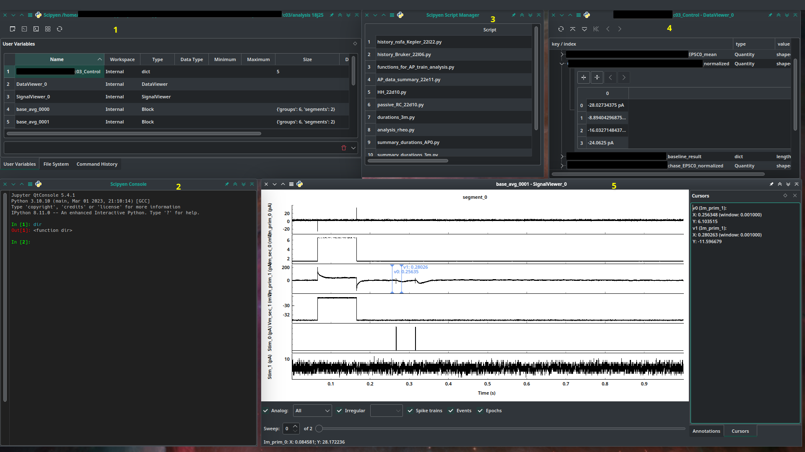

# Welcome to Scipyen

Scipyen (**Sci**entific **py**thon **e**nvironment for **n**euroscience) is an
open-source environment for the analysis of electrophysiology and 
microscopy imaging data using Python programming language. 

Scipyen provides a framework similar to an Integrated 
Development Environment (IDE)[1](#NOTE_1), where the user creates their own data 
analysis workflows or pipelines according to their need. 

Instead of offering a preset collection of analysis scenarios[2](#NOTE_2), Scipyen integrates
third party numerical analysis software, a set of GUI tools for the visualization
of electrophysiology[3](#NOTE_3), microscopy[4](#NOTE_4), and tabular[5](#NOTE_5) data, and a
mechanism to run your own Python scripts.

## Main features
* [Graphical User Interface](https://en.wikipedia.org/wiki/Graphical_user_interface)[(GUI)](#Scipyen_screenshot) with 
    - read-only[6](#NOTE_6) access to the file system
    - a dynamic view into the workspace variables[7](#NOTE_7)
    - a command history viewer[8](#NOTE_8)
    - viewers for data objects
    - script manager[9](#Note_9)
* A Python console[10](#NOTE_10)

Scipyen session with:

1. The main window, with workspace viewer ("User variables"), file system viewer and command history.
2. The console
3. The script manager
4. Dictionary viewer (DataViewer_0)
5. Electrophysiology data viewer (SignalViewer_0)

* * * 
###### Footnotes:
<a name=NOTE_1>1.</a> See [Spyder](https://www.spyder-ide.org/) for a comprehensive scientific python environment
and [Eric](https://www.spyder-ide.org/) for Python programming with a wider purpose.
Also, see [GNU Octave](https://octave.org/), [Scilab](https://www.scilab.org/),
[Matlab](https://www.mathworks.com/products/matlab.html) 
and [Sage](https://www.sagemath.org/) for scientific programming environments 'outside' the Python universe.

<a name=NOTE_2>2.</a> Scipyen does contain some example analyses forkflows e.g. 
for mEPSC analysis, action potential analysis, LTP, and two-photon line scanning 
for fluorescence Ca2+ imaging. These workflows are specific to the author's lab 
environment and they are in continuous development.

<a name=NOTE_3>3.</a> Electrophysiology data is represented using [NeuralEnsemble](https://github.com/NeuralEnsemble)'s python [neo](https://github.com/NeuralEnsemble/python-neo) package.

<a name=NOTE_4>4.</a> For for a more extensive,
open source, software for image analysis see, for example, [ImageJ/Fiji](https://fiji.sc/) .

<a name=NOTE_5>5.</a> DataFrame objects from Python [pandas](https://pandas.pydata.org/) package and Matrices.

<a name=NOTE_6>6.</a> This is by design. Scipyen's author tries hard to avoid 
[re-inventing the wheel](https://en.wikipedia.org/wiki/Reinventing_the_wheel), and therefore Scipyen has no functionality to create/delete files and directories, other than saving data objects to the disk. Scipyen is intended to be used in a [Desktop 
environment](https://en.wikipedia.org/wiki/Desktop_environment) with [tools](https://en.wikipedia.org/wiki/File_manager) to navigate and modify the file system.
However, a context menu offers the possibility to open the current working directory in
a desktop [tool](https://en.wikipedia.org/wiki/File_manager).

<a name=NOTE_7>7.</a> Provides access to variables created during a session, including
instances of data type-specific viewers, and updates itself whenever variables are
created, modified, or removed. The items in the viewer are actionable via a context menu.

<a name=NOTE_8>8.</a> Commands are grouped by session, and can be replayed by double clicking, dragging into the console, or copy/pasted in a text editor to create scripts.

<a name=NOTE_9>9.</a> Scipyen does not provide its own script editor, but script can be edited in any suitable editor

<a name=NOTE_10>10.</a> Scipyen's console is based on jupyter qtconsole, and gives access to the "user workspace"[7](#NOTE_7). To keep things "clean", the workspace viewer shows *only* the variables created since the start of the session.
